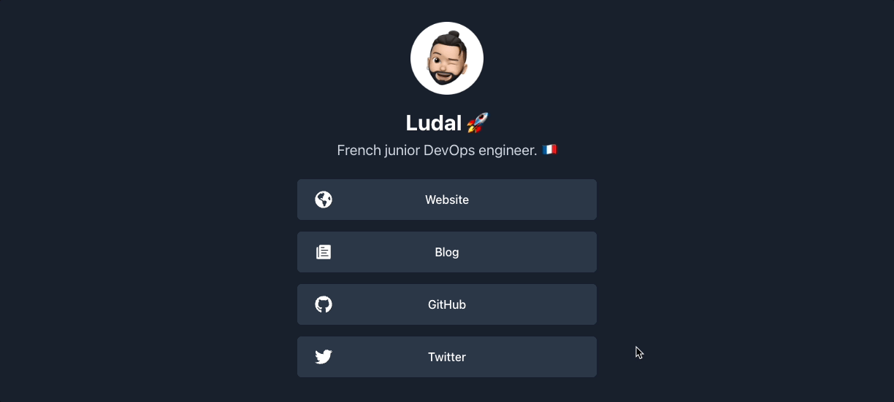

## Linktree 🌲

My simple [Linktree](https://linktr.ee/) clone built with [Next.js](https://nextjs.org/) 
and [Chakra UI](https://chakra-ui.com/).



### Setup

1. Install pre-commit hooks:

```bash
pre-commit install --install-hooks -t pre-commit -t commit-msg
```

2. Install dependencies:

```bash
yarn
```

3. Run the development server:

```bash
yarn dev
```

The app will be available at [http://localhost:3000](http://localhost:3000).

### Configuration

If you wish to use this clone, just fork this repo and edit the [src/config.ts](src/config.ts) file.
